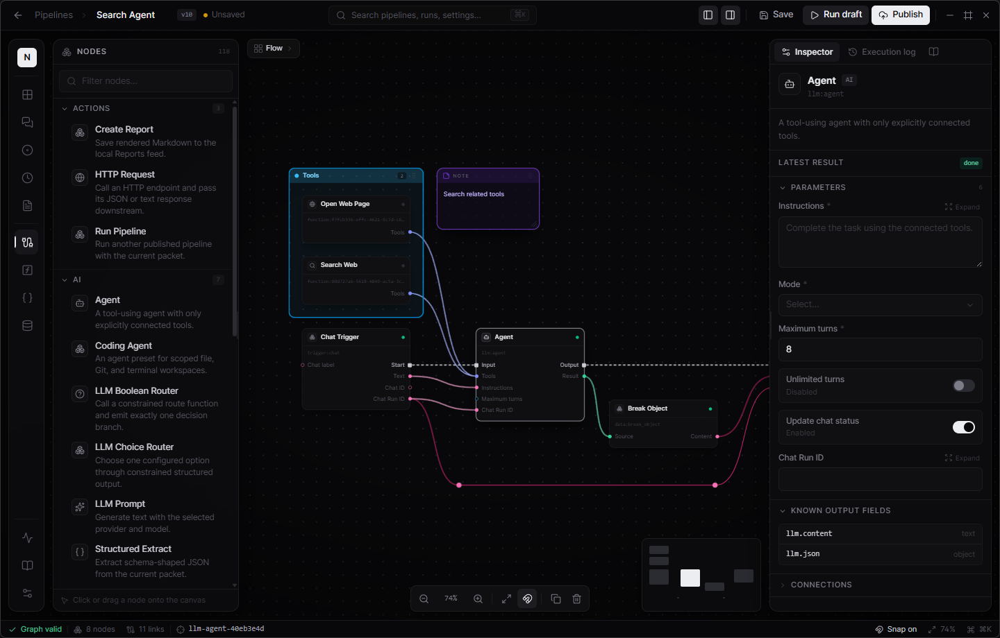

# Neuropipe



Neuropipe is a Windows-first desktop workspace for building local AI automations. It combines a Blueprint-style visual editor, local and compatible LLM providers, scheduled and button-triggered pipelines, chat, reports, and operational metrics in one Wails application.

Everything is designed to stay on your machine by default. Pipelines, reports, execution history, metrics, model metadata, and settings are stored in the local Neuropipe workspace. Secrets are kept separately in the Windows vault and are redacted from previews and logs.

## Install on Windows

The normal way to install Neuropipe is to download the installer from the [latest Neuropipe release](https://github.com/FlameInTheDark/neuropipe/releases/latest). It installs the desktop app without requiring Go, Bun, or Wails.

You can also [browse every release](https://github.com/FlameInTheDark/neuropipe/releases) to download a specific version or the standalone executable.

## What you can build

- Button boards, cron schedules, file watchers, hotkeys, chat, and HMAC-protected local webhooks.
- Blueprint-style pipelines where exec pins control actions and typed data pins resolve values on demand.
- Local LLM workflows using Ollama or managed `llama.cpp`, plus one configurable OpenAI-compatible provider.
- HTTP, local files, PowerShell, processes, clipboard, notifications, Git, reports, reusable functions, and AI agents.
- Markdown reports, local chat conversations, and a privacy-safe metrics dashboard.

## Getting started

1. Open **Settings** and choose a provider. For managed `llama.cpp`, select a runtime and an installed GGUF model.
2. Create a pipeline, add a trigger, then connect exec and data pins in the editor.
3. Configure its nodes, save the draft, and publish the revision after reviewing requested capabilities.
4. Run it from the editor or the Trigger board. Schedules and webhooks need an explicit trust grant before they run unattended.

The built-in **Documentation** tab contains detailed guides and a reference page for every available node.

## Build from source

To develop or build Neuropipe yourself, install Go 1.26+, Bun, and the [Wails v3 prerequisites](https://v3.wails.io/gettingstarted/installation/). Then install the Wails v3 CLI and run:

```bash
git clone https://github.com/FlameInTheDark/neuropipe.git
cd neuropipe
go install github.com/wailsapp/wails/v3/cmd/wails3@v3.0.0-beta.8
wails3 dev
```

To create a production Windows build:

```bash
wails3 generate syso -arch amd64 -icon build/icon.ico -manifest build/wails.exe.manifest -info build/info.json
go build -tags production -trimpath -ldflags "-s -w -H windowsgui" -o build/bin/neuropipe.exe
```

The executable and installer are written to `build/bin`.

## Development checks

```bash
cd frontend
bun install --frozen-lockfile
bun run check
bun run build

cd ..
go vet ./...
go test -race ./...
```

## Releases

Pull requests and pushes to `main` run the frontend type/build checks plus Go vet and race tests. Conventional commits on `main` create a semantic GitHub release. A second workflow builds the tagged Windows executable and NSIS installer, then attaches both to that release.

Use `feat:` for a minor release, `fix:` for a patch release, and add a breaking-change footer for a major release.
